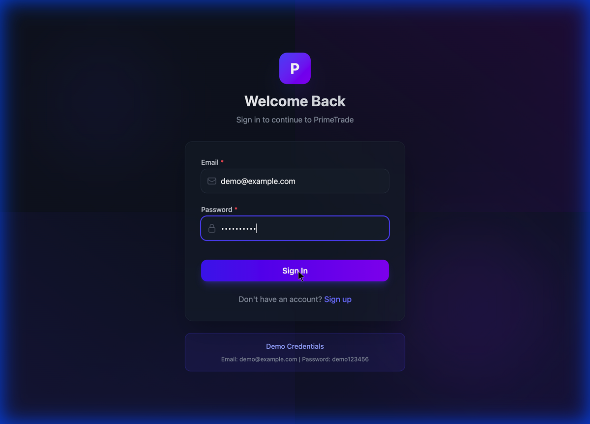
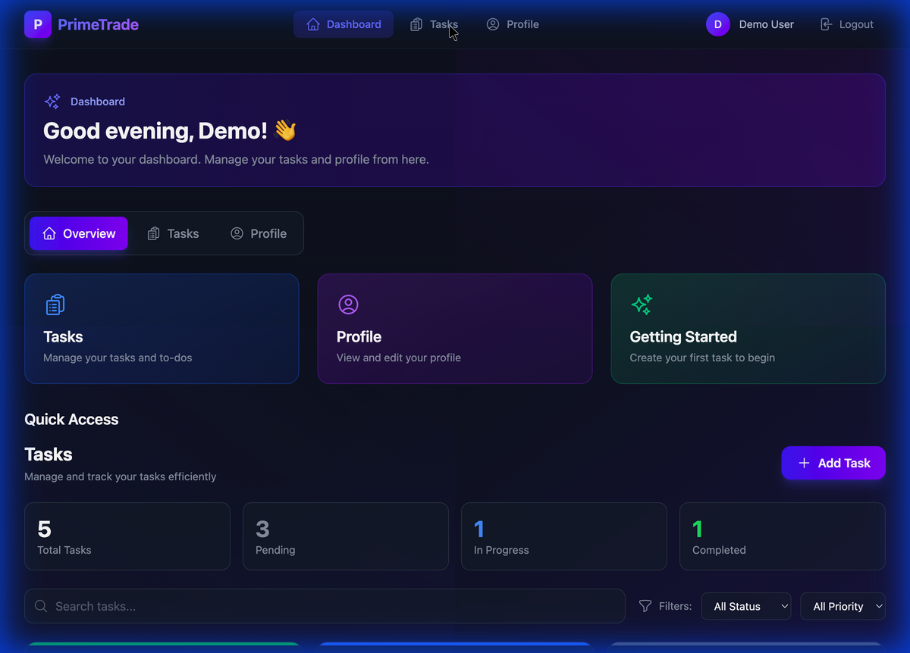
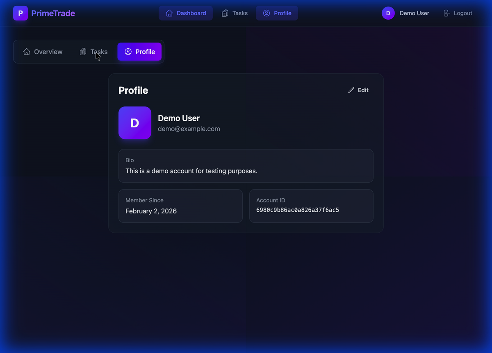

# PrimeTrade - Auth + Dashboard Application

A full-stack web application featuring user authentication, profile management, and task CRUD with a modern, responsive UI.

##  Tech Stack

| Layer | Technology |
|-------|------------|
| **Frontend** | React.js 18, Vite, TailwindCSS, React Router, Axios |
| **Backend** | Node.js, Express.js 4, JWT, bcrypt.js |
| **Database** | MongoDB with Mongoose ODM |
| **Styling** | TailwindCSS with custom animations |

##  Features

### Authentication
- ✅ User signup with validation
- ✅ User login with JWT tokens
- ✅ Password hashing with bcrypt
- ✅ Protected routes
- ✅ Persistent sessions

### Dashboard
- ✅ User profile view/edit
- ✅ Task CRUD (Create, Read, Update, Delete)
- ✅ Task search and filtering
- ✅ Status management (Pending, In Progress, Completed)
- ✅ Priority levels (Low, Medium, High)
- ✅ Responsive design

### Security
- ✅ Password hashing (bcrypt, 10 rounds)
- ✅ JWT authentication
- ✅ Input validation (frontend + backend)
- ✅ Protected API routes
- ✅ Error handling

##  Setup Instructions

### Prerequisites
- Node.js 18+
- MongoDB (local or Atlas)
- npm or yarn

### 1. Clone the Repository
```bash
git clone <repository-url>
cd primetrade
```

### 2. Backend Setup

```bash
cd backend
npm install
```

Create `.env` file (or use existing):
```env
PORT=5000
MONGODB_URI=mongodb://localhost:27017/primetrade
JWT_SECRET=your-secret-key-here
JWT_EXPIRES_IN=24h
NODE_ENV=development
```

Start MongoDB (if local):
```bash
# Using Docker
docker run -d -p 27017:27017 --name mongodb mongo:latest

# Or start your local MongoDB service
```

Seed demo data (optional):
```bash
npm run seed
```

Start the backend:
```bash
npm run dev
```

Backend runs on: `http://localhost:5000`

### 3. Frontend Setup

```bash
cd frontend
npm install
npm run dev
```

Frontend runs on: `http://localhost:5173`

##  Demo Credentials

| Email | Password |
|-------|----------|
| demo@example.com | demo123456 |
| admin@example.com | admin123456 |

*Run `npm run seed` in the backend folder to create these accounts.*

##  API Endpoints

### Authentication
| Method | Endpoint | Description |
|--------|----------|-------------|
| POST | `/api/v1/auth/signup` | Register new user |
| POST | `/api/v1/auth/login` | Login user |

### Profile
| Method | Endpoint | Description |
|--------|----------|-------------|
| GET | `/api/v1/me` | Get current user profile |
| PUT | `/api/v1/me` | Update user profile |

### Tasks
| Method | Endpoint | Description |
|--------|----------|-------------|
| GET | `/api/v1/tasks` | Get all tasks (with filters) |
| GET | `/api/v1/tasks/:id` | Get single task |
| POST | `/api/v1/tasks` | Create new task |
| PUT | `/api/v1/tasks/:id` | Update task |
| DELETE | `/api/v1/tasks/:id` | Delete task |

##  Project Structure

```
├── backend/
│   ├── src/
│   │   ├── config/         # Database configuration
│   │   ├── controllers/    # Route handlers
│   │   ├── middleware/     # Auth, validation, error handling
│   │   ├── models/         # Mongoose schemas
│   │   ├── routes/v1/      # API routes (versioned)
│   │   ├── utils/          # Logger utilities
│   │   ├── app.js          # Express app entry
│   │   └── seed.js         # Database seeder
│   └── package.json
│
├── frontend/
│   ├── src/
│   │   ├── components/     # Reusable UI components
│   │   ├── context/        # React context (Auth)
│   │   ├── hooks/          # Custom hooks
│   │   ├── pages/          # Page components
│   │   ├── services/       # API service layer
│   │   ├── utils/          # Validation helpers
│   │   └── App.jsx         # Main app component
│   └── package.json
│
├── postman_collection.json
└── README.md
```

### Performance Optimizations
1. **Database Indexing**: Add indexes on frequently queried fields
   - `tasks.user` + `tasks.status` compound index
   - `users.email` unique index
2. **Caching**: Implement Redis for session storage and API caching
3. **Rate Limiting**: Add express-rate-limit for API protection
4. **Pagination**: Implement cursor-based pagination for large datasets

### Security Enhancements
1. **CORS**: Configure strict CORS policies for production domains
3. **Refresh Tokens**: Implement refresh token rotation
4. **Environment**: Use separate configs for dev/staging/prod

### Infrastructure
1. **Load Balancing**: Use nginx or cloud load balancers
2. **Logging**: Integrate with Datadog/CloudWatch for monitoring
3. **CI/CD**: GitHub Actions for automated testing and deployment

##  API Testing

Import the `postman_collection.json` file into Postman to test all endpoints.

---

##  Application Walkthrough

### Login Page
Modern login page with form validation and demo credentials:



### Dashboard Overview
Dashboard showing task statistics and quick access cards:



### Profile Page
User profile with bio, member information, and edit capabilities:



---


##  Author

Built for PrimeTrade Frontend Developer Intern Assessment
